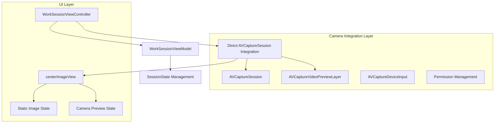
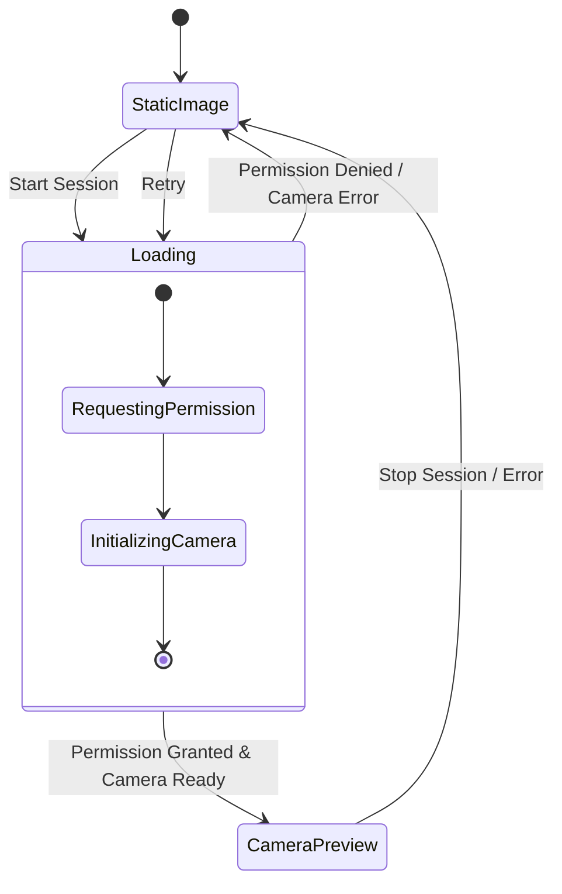

# Design Document

## Overview

本设计文档描述了在WorkSessionViewController中集成摄像头预览功能的技术方案。该功能将在用户点击开始工作按钮时，将centerImageView从静态图片切换为实时摄像头预览，为后续的体态检测功能提供视觉基础。

设计目标：
- 复用现有的摄像头服务架构，确保代码一致性
- 保持现有UI设计的视觉连贯性
- 提供优雅的权限处理和错误恢复机制
- 确保性能优化和内存管理

## Architecture

### 整体架构图



### 核心设计原则

1. **直接集成**: 直接在WorkSessionViewController中集成AVCaptureSession，参考CameraTestViewController的实现
2. **删除现有服务**: 移除CameraService和SimpleCameraService，使用更简单直接的方案
3. **状态驱动**: 摄像头预览的显示完全由WorkSessionViewModel的sessionState控制
4. **渐进增强**: 摄像头功能作为增强功能，不影响基础计时器功能
5. **内存安全**: 确保摄像头会话在适当时机启动和停止

## Components and Interfaces

### 1. WorkSessionViewController 摄像头集成

直接在WorkSessionViewController中集成摄像头功能，参考CameraTestViewController的实现。

```swift
extension WorkSessionViewController {
    // MARK: - Camera Properties
    private let captureSession = AVCaptureSession()
    private var previewLayer: AVCaptureVideoPreviewLayer?
    private let sessionQueue = DispatchQueue(label: "camera.session.queue")
    
    // MARK: - Camera Methods
    private func setupCameraSession()
    private func startCameraPreview()
    private func stopCameraPreview()
    private func checkPermissionAndSetup()
    private func transitionToCamera()
    private func transitionToStaticImage()
}
```

### 2. 移除现有摄像头服务

需要删除的组件：
- `CameraService.swift` - 复杂的摄像头服务实现
- `SimpleCameraService.swift` - 简化的摄像头服务
- `UIKitCameraPreviewView.swift` - UIKit摄像头预览组件

这些组件将被WorkSessionViewController中的直接集成替代。

### 3. 状态管理接口

```swift
enum CenterImageViewState {
    case staticImage(UIImage?)
    case cameraPreview
    case loading
    case error(HealthyCodeError)
}
```

## Data Models

### CameraIntegrationState

```swift
struct CameraIntegrationState {
    let isActive: Bool
    let permissionStatus: AVAuthorizationStatus
    let error: HealthyCodeError?
    let isTransitioning: Bool
    
    var shouldShowCamera: Bool {
        return isActive && permissionStatus == .authorized && error == nil
    }
    
    var shouldShowStaticImage: Bool {
        return !isActive || permissionStatus != .authorized || error != nil
    }
}
```

### 状态转换图



## Error Handling

### 错误类型和处理策略

1. **权限相关错误**
   - `cameraPermissionDenied`: 显示权限请求对话框
   - `cameraPermissionRestricted`: 显示设置引导

2. **硬件相关错误**
   - `cameraNotAvailable`: 回退到静态图片模式
   - `cameraSessionInterrupted`: 自动重试机制

3. **系统相关错误**
   - `lowMemoryWarning`: 暂停摄像头预览
   - `backgroundTransition`: 自动停止摄像头

### 错误恢复机制

```swift
protocol CameraErrorRecovery {
    func handlePermissionDenied() -> RecoveryAction
    func handleCameraUnavailable() -> RecoveryAction
    func handleSessionInterruption() -> RecoveryAction
}

enum RecoveryAction {
    case showPermissionDialog
    case fallbackToStaticImage
    case retryAfterDelay(TimeInterval)
    case openSettings
}
```

## Testing Strategy

### 单元测试

1. **CameraIntegrationManager Tests**
   ```swift
   class CameraIntegrationManagerTests: XCTestCase {
       func testCameraSetup()
       func testPermissionHandling()
       func testStateTransitions()
       func testErrorRecovery()
   }
   ```

2. **State Management Tests**
   ```swift
   class CameraStateTests: XCTestCase {
       func testStateTransitionLogic()
       func testErrorStateHandling()
       func testPermissionStateChanges()
   }
   ```

### 集成测试

1. **UI Integration Tests**
   - 测试centerImageView的状态切换
   - 测试动画过渡效果
   - 测试用户交互响应

2. **Camera Service Integration**
   - 测试与SimpleCameraService的集成
   - 测试预览层的正确显示
   - 测试内存管理

### 设备测试场景

1. **权限测试**
   - 首次安装应用的权限请求流程
   - 权限被拒绝后的恢复流程
   - 从设置中重新授权的处理

2. **硬件测试**
   - 不同设备型号的摄像头兼容性
   - 前置摄像头不可用的处理
   - 摄像头被其他应用占用的处理

3. **性能测试**
   - 摄像头启动时间测试
   - 内存使用情况监控
   - 电池消耗影响评估

## Implementation Details

### 核心实现流程

1. **初始化阶段**
   ```swift
   // 在WorkSessionViewController.viewDidLoad中
   setupCameraIntegration()
   ```

2. **开始会话时的摄像头激活**
   ```swift
   // 在primaryActionTapped中
   if viewModel.sessionState == .idle {
       await cameraManager.startCameraPreview()
       transitionToCamera()
   }
   ```

3. **会话结束时的摄像头停止**
   ```swift
   // 在会话状态变化时
   if viewModel.sessionState == .idle {
       cameraManager.stopCameraPreview()
       transitionToStaticImage()
   }
   ```

### 动画和过渡效果

```swift
private func transitionToCamera() {
    UIView.transition(with: centerImageView, duration: 0.5, options: .transitionCrossDissolve) {
        // 设置摄像头预览层
        self.setupCameraPreviewLayer()
    }
}

private func transitionToStaticImage() {
    UIView.transition(with: centerImageView, duration: 0.3, options: .transitionCrossDissolve) {
        // 恢复静态图片
        self.centerImageView.image = UIImage(named: "a1")
    }
}
```

### 内存管理策略

1. **生命周期管理**
   - 在viewWillAppear时检查摄像头状态
   - 在viewDidDisappear时暂停摄像头
   - 在deinit时确保资源释放

2. **内存优化**
   - 使用弱引用避免循环引用
   - 及时释放AVCaptureSession资源
   - 监听内存警告并适当降级

### 与现有代码的集成点

1. **WorkSessionViewModel集成**
   - 扩展sessionState以包含摄像头状态
   - 添加摄像头权限检查方法
   - 集成错误处理机制

2. **CameraTestViewController代码复用**
   - 直接复用CameraTestViewController中的摄像头设置逻辑
   - 复用权限请求和错误处理代码
   - 保持相同的AVCaptureSession配置

3. **UI组件复用**
   - 复用CameraTestViewController中的圆形预览实现
   - 保持与现有UI设计的一致性（280x280圆形容器）
   - 复用视频方向设置和预览层配置

### 需要删除的文件

实现此功能时需要删除以下文件：
- `VibeHead/Services/CameraService.swift`
- `VibeHead/Services/SimpleCameraService.swift`
- `VibeHead/Views/UIKit/UIKitCameraPreviewView.swift`

这些文件的功能将被WorkSessionViewController中的直接集成替代。