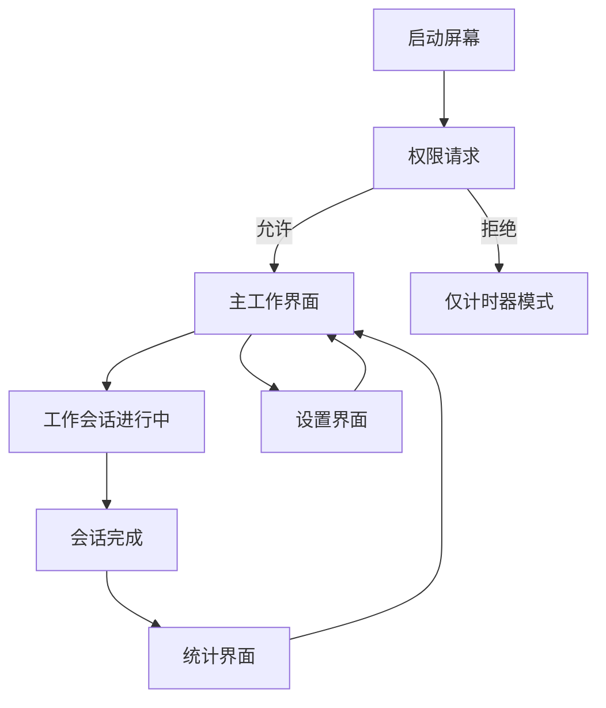

# 设计文档

## 概述

HealthyCode 采用现代iOS开发技术栈，结合Vision Framework实现实时体态检测和番茄工作法。应用采用MVVM架构模式，使用SwiftUI构建用户界面，Combine处理响应式数据流，确保高性能和良好的用户体验。

## 架构

### 整体架构模式

应用采用 **MVVM (Model-View-ViewModel)** 架构模式：

```
┌─────────────────┐    ┌─────────────────┐    ┌─────────────────┐
│     Views       │◄──►│   ViewModels    │◄──►│     Models      │
│   (SwiftUI)     │    │   (ObservableObject)│    │   (Data Layer)  │
└─────────────────┘    └─────────────────┘    └─────────────────┘
                              │
                              ▼
                       ┌─────────────────┐
                       │    Services     │
                       │ (Business Logic)│
                       └─────────────────┘
```

### 核心组件层次

1. **Presentation Layer (表现层)**
   - SwiftUI Views
   - ViewModels (ObservableObject)

2. **Business Logic Layer (业务逻辑层)**
   - PomodoroService：番茄时钟逻辑
   - PostureDetectionService：体态检测服务
   - StatisticsService：统计计算服务

3. **Data Layer (数据层)**
   - Models：数据模型
   - Repositories：数据访问抽象
   - UserDefaults：本地存储

4. **Platform Layer (平台层)**
   - Vision Framework：面部检测
   - AVFoundation：摄像头处理
   - Core Haptics：触觉反馈

## 组件和接口

### 核心数据模型

```swift
// 体态类型枚举
enum PostureType: String, CaseIterable, Codable {
    case excellent = "优雅"
    case lookingDown = "低头" 
    case tilted = "歪头"
    case tooClose = "太近"
    
    var color: Color {
        switch self {
        case .excellent: return .green
        default: return .orange
        }
    }
    
    var isHealthy: Bool {
        return self == .excellent
    }
}

// 番茄工作会话模型
struct PomodoroSession: Codable, Identifiable {
    let id = UUID()
    let startTime: Date
    let duration: TimeInterval
    let postureData: [PostureRecord]
    
    var healthScore: Double {
        let excellentTime = postureData
            .filter { $0.posture == .excellent }
            .reduce(0) { $0 + $1.duration }
        return (excellentTime / duration) * 100
    }
}

// 体态记录模型
struct PostureRecord: Codable {
    let posture: PostureType
    let startTime: Date
    let duration: TimeInterval
}

// 应用设置模型
struct AppSettings: Codable {
    var workDuration: TimeInterval = 25 * 60 // 默认25分钟
    var breakDuration: TimeInterval = 5 * 60 // 默认5分钟
    var enableHapticFeedback: Bool = true
    var enableAudioAlerts: Bool = true
    var postureCheckInterval: TimeInterval = 1.0 // 每秒检查一次
}
```

### 服务接口

```swift
// 番茄时钟服务协议
protocol PomodoroServiceProtocol: ObservableObject {
    var currentSession: PomodoroSession? { get }
    var timeRemaining: TimeInterval { get }
    var isRunning: Bool { get }
    var settings: AppSettings { get set }
    
    func startSession()
    func pauseSession()
    func resetSession()
    func completeSession()
}

// 体态检测服务协议
protocol PostureDetectionServiceProtocol: ObservableObject {
    var currentPosture: PostureType { get }
    var isDetecting: Bool { get }
    var cameraPermissionStatus: AVAuthorizationStatus { get }
    
    func startDetection()
    func stopDetection()
    func requestCameraPermission() async -> Bool
}

// 统计服务协议
protocol StatisticsServiceProtocol {
    func saveSession(_ session: PomodoroSession)
    func getSessionHistory() -> [PomodoroSession]
    func calculateHealthTrends() -> HealthTrends
    func clearAllData()
}
```

### 主要ViewModels

```swift
// 主工作界面ViewModel
class WorkSessionViewModel: ObservableObject {
    @Published var pomodoroService: PomodoroServiceProtocol
    @Published var postureService: PostureDetectionServiceProtocol
    @Published var showingStats = false
    
    private var cancellables = Set<AnyCancellable>()
    
    func startWorkSession() {
        pomodoroService.startSession()
        postureService.startDetection()
    }
    
    func pauseSession() {
        pomodoroService.pauseSession()
        postureService.stopDetection()
    }
}

// 统计界面ViewModel
class StatisticsViewModel: ObservableObject {
    @Published var currentSession: PomodoroSession?
    @Published var sessionHistory: [PomodoroSession] = []
    @Published var healthTrends: HealthTrends?
    
    private let statisticsService: StatisticsServiceProtocol
    
    func loadStatistics() {
        sessionHistory = statisticsService.getSessionHistory()
        healthTrends = statisticsService.calculateHealthTrends()
    }
}
```

## 数据模型

### 体态检测数据流

```mermaid
graph TD
    A[AVCaptureSession] --> B[Camera Frame]
    B --> C[Vision Framework]
    C --> D[VNFaceObservation]
    D --> E[Face Analysis]
    E --> F{Posture Classification}
    F -->|pitch < -0.3| G[低头]
    F -->|abs(roll) > 0.25| H[歪头]
    F -->|boundingBox.height > 0.6| I[太近]
    F -->|正常范围| J[优雅]
    G --> K[PostureRecord]
    H --> K
    I --> K
    J --> K
    K --> L[Statistics Update]
```

### 数据持久化策略

```swift
// UserDefaults键值定义
enum UserDefaultsKeys {
    static let appSettings = "app_settings"
    static let sessionHistory = "session_history"
    static let lastSessionDate = "last_session_date"
}

// 数据仓库实现
class LocalDataRepository: StatisticsServiceProtocol {
    private let userDefaults = UserDefaults.standard
    private let encoder = JSONEncoder()
    private let decoder = JSONDecoder()
    
    func saveSession(_ session: PomodoroSession) {
        var history = getSessionHistory()
        history.append(session)
        
        // 只保留最近30天的数据
        let thirtyDaysAgo = Date().addingTimeInterval(-30 * 24 * 60 * 60)
        history = history.filter { $0.startTime > thirtyDaysAgo }
        
        if let data = try? encoder.encode(history) {
            userDefaults.set(data, forKey: UserDefaultsKeys.sessionHistory)
        }
    }
}
```

## 错误处理

### 错误类型定义

```swift
enum HealthyCodeError: LocalizedError {
    case cameraPermissionDenied
    case cameraNotAvailable
    case visionFrameworkError(Error)
    case dataCorruption
    case sessionInProgress
    
    var errorDescription: String? {
        switch self {
        case .cameraPermissionDenied:
            return "需要摄像头权限来检测体态"
        case .cameraNotAvailable:
            return "摄像头不可用"
        case .visionFrameworkError(let error):
            return "体态检测错误: \(error.localizedDescription)"
        case .dataCorruption:
            return "数据损坏，请重置应用设置"
        case .sessionInProgress:
            return "当前有会话正在进行中"
        }
    }
}
```

### 错误处理策略

1. **摄像头权限错误**：优雅降级到仅计时器模式
2. **Vision Framework错误**：显示错误提示，继续计时器功能
3. **数据损坏**：提供重置选项，保护用户体验
4. **网络相关错误**：本地优先，无网络依赖

## 测试策略

### 单元测试覆盖

```swift
// 测试用例示例
class PostureDetectionTests: XCTestCase {
    var sut: PostureDetectionService!
    var mockVisionService: MockVisionService!
    
    func testPostureClassification_WhenHeadTiltedDown_ShouldDetectLookingDown() {
        // Given
        let faceObservation = createMockFaceObservation(pitch: -0.4)
        
        // When
        sut.analyzeFace(faceObservation)
        
        // Then
        XCTAssertEqual(sut.currentPosture, .lookingDown)
    }
    
    func testHealthScoreCalculation_WithMixedPostures_ShouldReturnCorrectScore() {
        // Given
        let session = createTestSession(excellentTime: 15*60, totalTime: 25*60)
        
        // When
        let score = session.healthScore
        
        // Then
        XCTAssertEqual(score, 60.0, accuracy: 0.1)
    }
}
```

### UI测试策略

```swift
class HealthyCodeUITests: XCTestCase {
    func testWorkSessionFlow_StartPauseReset_ShouldUpdateUICorrectly() {
        let app = XCUIApplication()
        app.launch()
        
        // 测试开始会话
        app.buttons["开始工作"].tap()
        XCTAssertTrue(app.buttons["暂停"].exists)
        
        // 测试暂停功能
        app.buttons["暂停"].tap()
        XCTAssertTrue(app.buttons["继续"].exists)
        
        // 测试重置功能
        app.buttons["重置"].tap()
        XCTAssertTrue(app.buttons["开始工作"].exists)
    }
}
```

### 性能测试

1. **内存使用监控**：确保长时间运行不会内存泄漏
2. **CPU使用优化**：Vision Framework处理频率控制
3. **电池消耗测试**：摄像头使用对电池的影响
4. **响应时间测试**：UI操作响应时间 < 2秒

### 设备兼容性测试

```swift
// 设备能力检测
class DeviceCapabilityChecker {
    static func supportsAdvancedFaceTracking() -> Bool {
        if #available(iOS 11.0, *) {
            return ARFaceTrackingConfiguration.isSupported
        }
        return false
    }
    
    static func supportsBasicFaceDetection() -> Bool {
        return true // Vision Framework 在所有支持的iOS版本上可用
    }
}
```

## 用户界面设计

### 屏幕流程图



### 关键界面组件

1. **主工作界面**
   - 圆形进度指示器（番茄时钟）
   - 摄像头预览窗口
   - 当前体态状态指示器
   - 开始/暂停/重置按钮

2. **统计界面**
   - 健康分数大字体显示
   - 体态时间分解水平进度条
   - 时间轴图表（Swift Charts）
   - 分享按钮

3. **设置界面**
   - 工作时长滑块
   - 休息时长设置
   - 提醒选项开关
   - 数据清除选项

### 颜色系统和主题

```swift
extension Color {
    static let healthyGreen = Color(red: 0.2, green: 0.8, blue: 0.4)
    static let warningOrange = Color(red: 1.0, green: 0.6, blue: 0.2)
    static let alertRed = Color(red: 0.9, green: 0.3, blue: 0.3)
    static let primaryBlue = Color(red: 0.2, green: 0.6, blue: 1.0)
    
    // 深色模式适配
    static let adaptiveBackground = Color(UIColor.systemBackground)
    static let adaptiveText = Color(UIColor.label)
}
```

## 性能优化

### 摄像头处理优化

1. **帧率控制**：限制为15fps以节省电池
2. **分辨率优化**：使用较低分辨率进行面部检测
3. **后台处理**：Vision Framework在后台队列运行
4. **智能暂停**：应用进入后台时停止检测

### 内存管理

1. **及时释放**：摄像头缓冲区及时释放
2. **数据限制**：历史数据限制在30天内
3. **图像处理**：避免保存原始图像数据

### 电池优化策略

```swift
class PowerManagementService {
    func adjustDetectionFrequency(batteryLevel: Float) {
        switch batteryLevel {
        case 0.0..<0.2: // 电量低于20%
            postureCheckInterval = 3.0 // 每3秒检查一次
        case 0.2..<0.5: // 电量20%-50%
            postureCheckInterval = 2.0 // 每2秒检查一次
        default:
            postureCheckInterval = 1.0 // 每秒检查一次
        }
    }
}
```